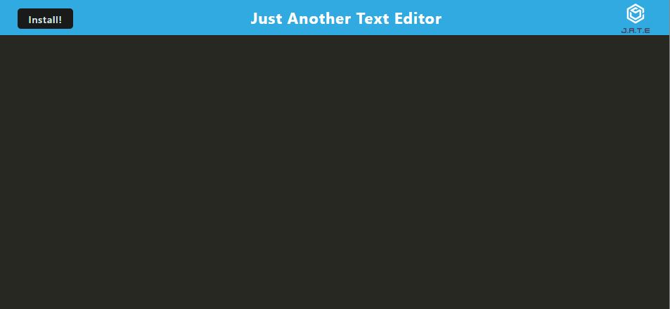

# PWA_Text_Editor


## Description

Take notes with JavaScript syntax highlighting. The user can start and install the project .

## Table of Contents 

* [Installation](#installation)

* [Usage](#usage)

* [License](#license)

* [Contributing](#contributing)

* [Tests](#tests)

* [Questions](#questions)

* [Screenshot](#screenshot)

## Installation

To install necessary dependencies, run the following command:

```
npm run install
```

## Usage

Clone the repo and run npm run start to use the project

## License

This project is licensed under the MIT license.
  
## Contributing

Nothing

## Tests

To run tests, run the following command:

```
There are no tests
```

## Screenshot



## Questions

If you have any questions about the repo, open an issue or contact me directly at daniel.robe@verizon.net. You can find more of my work at [Daniel-robe](https://github.com/Daniel-robe/).

